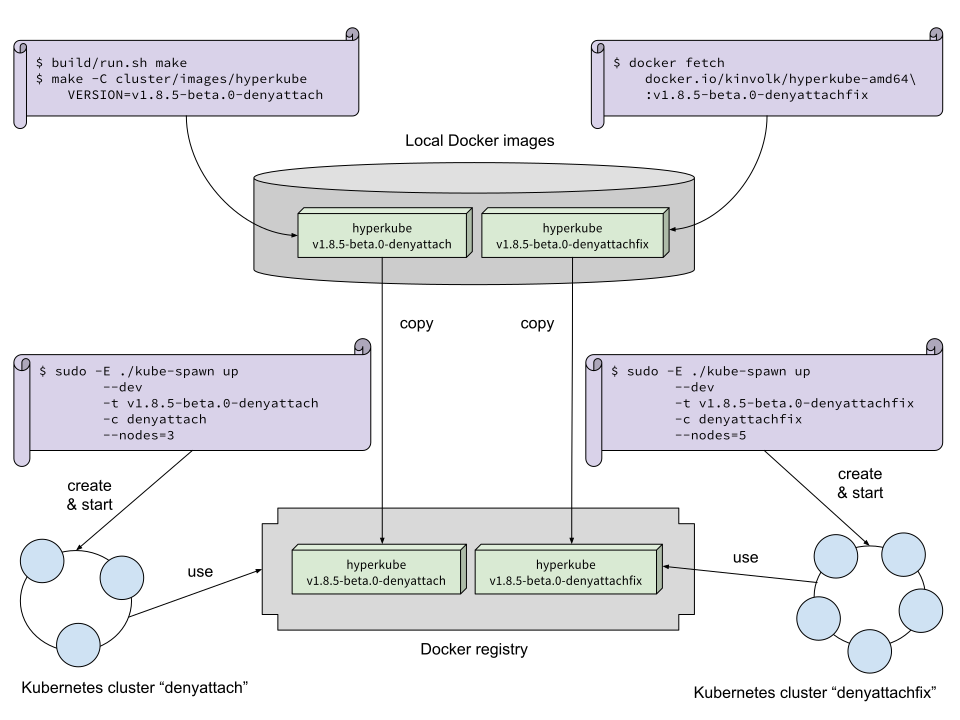

# Kubernetes development workflow example

This article describes a step-by-step example of workflow that a Kubernetes developer might follow when patching Kubernetes.

For the purpose of the article, we will write a new [admission controller](https://kubernetes.io/docs/admin/admission-controllers/) named `DenyAttach` that inconditionally denies all attaching to a container. The end result will be:

```bash
$ kubectl attach mypod-74c9fd65cb-n5hsg
If you don't see a command prompt, try pressing enter.
Error from server (Forbidden): pods "mypod-74c9fd65cb-n5hsg" is forbidden: cannot attach to a container, rejected by admission controller
```

The implementation of `DenyAttach` will be reusing code from the existing admission controller [DenyEscalatingExec](https://kubernetes.io/docs/admin/admission-controllers/#denyescalatingexec).



## Compiling locally

We will first fetch the [patch](https://github.com/kinvolk/kubernetes/commit/c117bd71672b2da7c7777cddf0287b07d29b90e5).

```bash
$ cd $GOPATH/src/k8s.io/kubernetes

# Add git kinvolk remote if not already done
$ git remote |grep -q kinvolk || git remote add kinvolk https://github.com/kinvolk/kubernetes

# Fetch the branch
$ git pull kinvolk alban/v1.8.5-beta.0-denyattach
$ git checkout kinvolk/alban/v1.8.5-beta.0-denyattach

# Build Kubernetes
$ build/run.sh make

# Build a Hyperkube Docker image with a tag
$ make -C cluster/images/hyperkube VERSION=v1.8.5-beta.0-denyattach
```

docker images | grep hyperkube-amd64

## Deploying your build on kube-spawn

```
# Spawn and provision nodes for the cluster
$ sudo -E ./kube-spawn create --dev -t v1.8.5-beta.0-denyattach -c denyattach
$ sudo -E ./kube-spawn start -c denyattach
```

## Testing the new DenyAttach admission controller

```
$ export KUBECONFIG=/var/lib/kube-spawn/denyattach/kubeconfig
$ kubectl get nodes
kubespawndenyattach0   Ready     master    1h        v1.8.5-beta.0.1+c117bd71672b2d-dirty
kubespawndenyattach1   Ready     <none>    1h        v1.8.5-beta.0.1+c117bd71672b2d-dirty
```

Once all nodes are ready, deploy a simple pod:
```
kubectl run mypod --image=busybox --command -- /bin/sh -c 'while true ; do sleep 1 ; date ; done'
```

Get the name of your pod:
```
$ kubectl get pod
NAME                     READY     STATUS    RESTARTS   AGE
mypod-74c9fd65cb-n5hsg   1/1       Running   0          25m
```

Check that the pod works correctly but that attaching is not possible:
```
$ kubectl logs mypod-74c9fd65cb-n5hsg | tail -2
Sun Nov 26 15:17:32 UTC 2017
Sun Nov 26 15:17:33 UTC 2017
$ kubectl attach mypod-74c9fd65cb-n5hsg
If you don't see a command prompt, try pressing enter.
Error from server (Forbidden): pods "mypod-74c9fd65cb-n5hsg" is forbidden: cannot attach to a container, rejected by admission controller
```

## Sharing the hyperkube image

```
docker tag gcr.io/google-containers/hyperkube-amd64:v1.8.5-beta.0-denyattach docker.io/kinvolk/hyperkube-amd64:v1.8.5-beta.0-denyattach
docker push docker.io/kinvolk/hyperkube-amd64:v1.8.5-beta.0-denyattach
```

Then, this image can be tested by other developers.

## Using an external hyperkube image

Someone might not like the error message, saying "rejected by admission controller":
Kubernetes has plenty of admission controllers and it does not say which one rejected the request.

If someone develops a fix for the error message, you can pull that version and test it with kube-spawn without compiling Kubernetes yourself by naming the image in the same way a local build would do:

```
$ docker pull docker.io/kinvolk/hyperkube-amd64:v1.8.5-beta.0-denyattachfix
$ docker tag docker.io/kinvolk/hyperkube-amd64:v1.8.5-beta.0-denyattachfix gcr.io/google-containers/hyperkube-amd64:v1.8.5-beta.0-denyattachfix
```

Then, you can start another kube-spawn cluster:
```
$ sudo -E ./kube-spawn create --dev -t v1.8.5-beta.0-denyattachfix -c denyattachfix
$ sudo -E ./kube-spawn start -c denyattachfix
```

By running the same test as before, you could see the different error message:
```
$ kubectl attach mypod-74c9fd65cb-48d9m
If you don't see a command prompt, try pressing enter.
Error from server (Forbidden): pods "mypod-74c9fd65cb-48d9m" is forbidden: cannot attach to a container, rejected by DenyAttach
```

This new version of the patch is available on [github](https://github.com/kinvolk/kubernetes/commit/eb0c026372a67eb49bbf80aa619f10ee94527bac).

### Limitations

The hyperkube image contains the api server, the controller manager and the scheduler but not `kubeadm`.
Therefore, if your patch makes changes in kubeadm, it has to be compiled locally: pulling a remote hyperkube image will not be enough.

## Running several kube-spawn clusters in parallel

You can build several hyperkube versions and run several kube-spawn clusters in parallel by giving them different names with the `-c` option.

```
$ KUBECONFIG=/var/lib/kube-spawn/denyattach/kubeconfig kubectl get pod
NAME                     READY     STATUS    RESTARTS   AGE
mypod-74c9fd65cb-n5hsg   1/1       Running   0          59m

$ KUBECONFIG=/var/lib/kube-spawn/denyattachfix/kubeconfig kubectl get pod
NAME                     READY     STATUS    RESTARTS   AGE
mypod-74c9fd65cb-48d9m   1/1       Running   0          3m
...

$ machinectl
MACHINE                          CLASS     SERVICE        OS     VERSION  ADDRESSES
3436870bac346e5ad5a7699b92c21834 container docker         alpine 3.4.6    172.17.0.2...
kubespawndenyattach0             container systemd-nspawn coreos 1492.1.0 10.22.0.2...
kubespawndenyattach1             container systemd-nspawn coreos 1492.1.0 10.22.0.3...
kubespawndenyattachfix0          container systemd-nspawn coreos 1492.1.0 10.22.0.4...
kubespawndenyattachfix1          container systemd-nspawn coreos 1492.1.0 10.22.0.5...

5 machines listed.
```

### Limitations

If your cluster name finishes with a digit, the node names might conflict.
To avoid this, I used the cluster names "denyattach" and "denyattachfix".
