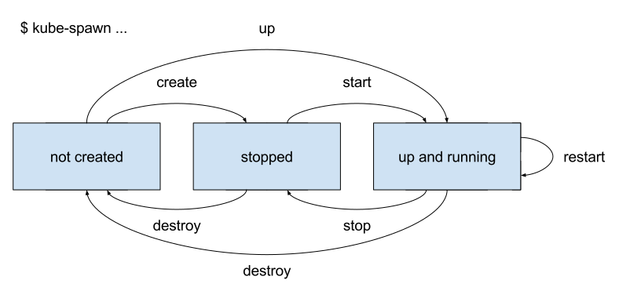

# Workflow

A Kubernetes cluster can be managed by kube-spawn with the following commands: create, start, up, restart, stop, destroy.

Several Kubernetes clusters can be managed simultaneously. The configuration of each of them is stored in `/var/lib/kube-spawn/$CLUSTER_NAME` by default (referred by **cluster-dir** below) but this can be changed with `--dir`. The cluster name itself is set by `--cluster-name` and defaults to `default`. These two flags can be used in all commands below.

## `create`

The command `create` prepares the Kubernetes cluster without actually starting it.

* generate a new configuration for the specified cluster with the built-in defaults (see `pkg/config/defaults.go`)
* if we don't run with `--dev` download the needed binaries
  - `kubelet`, `kubeadm`, `kubectl`
* download `socat` (needed for port-forwarding)
* check/setup the host environment for requirements:
  - base image available (download if not and using default - `coreos`), can be set with `--image`
  - filesystem of **cluster-dir** supports overlayfs
  - cni networking
  - modprobe `nf_conntrack`
  - set iptables rules for cni
  - selinux
  - _check version of CoreOS image_
* generate scripts and configs (using `pkg/script`)
* write config to **cluster-dir**

To make files from the host available to the machines of the cluster we use the [`--overlay`][1] and [`--bind`][2] options of
`systemd-nspawn`.

[1]: https://www.freedesktop.org/software/systemd/man/systemd-nspawn.html#--overlay=
[2]: https://www.freedesktop.org/software/systemd/man/systemd-nspawn.html#--bind=

Under the **cluster-dir** you can find a directory called `rootfs`, as well as directories for every machine of the
cluster containing a `rootfs` directory as well.
Their subdirectories get overlayed on running `kube-spawn start`, with the machine dir being the upper-most, meaning all
modified files get written to it.

It is important that only `/etc`, `/opt` and `/bin` can be used.

Files and directories can also be bindmounted by editing the `kspawn.toml` file found in the **cluster-dir**.
It contains cluster-wide and per-machine `bindmount` sections for *read-write* and *read-only* bind.

_**[!]** the other commands load the configuration from **cluster-dir** , this means they will not work without it_

## `start`

The command `start` starts a previously created Kubernetes cluster.

* start *n* machines, can be set with `--nodes` on `create`
* run:
  - `kubeadm init` on the first machine
  - `kubeadm join` on the rest

## `up`

The `start` command performs both `create` and `start` in one go.

## `stop`

The command `stop` stops a previously running Kubernetes cluster. Nothing is deleted, so the cluster can be restarted later.

* stop running nodes
* no cleanup

## `restart`

The command `restart` performs `stop` and `start` in one go.

## `destroy`

The command `destroy` removes the cluster without leaving traces.

* run stop
* remove **cluster-dir**
* remove cni networks created by `cnispawn`
